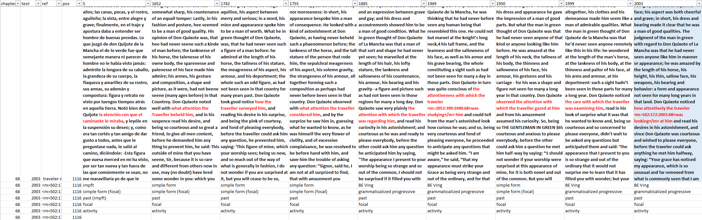

# juliette-aspect-dataset
Converting Juliette's wonky Excel file to clean TSV

## Description of the source dataset

The original dataset features a record *and* column-based attribute-value layout. Parallel corpus hits are placed next to each other in separate columns, with the subsequent records detailing annotations of those corpus hits. Some data is shared across records (i.e. the leading columns on the left). This general structure is repeated for each attestation across the parallel corpora.

## Output format

In order to make the dataset ready for statistical analysis, it had to be converted to a conventional record-based table format. The desired output is as follows:

| meta variables | ... | year| corpus text | linguistic annotations | ... |
|---|---|---|---|---|---|
|text 0478 ...|...|1652|"few gray haires, his face was somewhat sharp [...]|simple form ...|...|

## Methodology

I used Python with Pandas to iterate over each row in the source dataset. The script iterates over all years treated in the dataset, and "remembers" their values for each attestation. Subsequently, the linguistic annotation values are collected when iterating over the rows following the text row. The new rows are added to the new set of rows in chunks. Finally, the new rows are converted to a pandas DataFrame, and then exported to TSV and Excel.

## How to use

### Windows

1. Download `juliette-convert.exe` from the Releases (sidebar on the right)
    - If you are using a GHUM managed KU Leuven computer, put the exe in `C:\Workdir\MyApps\`, else the program will be blocked by a group policy
2. Drop a TSV/TXT file (as long as the contents are tab-delimited, it's fine) on `juliette-convert.exe`. You should see the output TSV and XLSX files appear in the same directory
    - You can also use the command line, using the same arguments as below

### From source (macOS/Linux)

1. Install dependencies (`requirements.txt`)
2. Place the original dataset as TSV in the repository root
3. Run `python3 juliette-convert.py <filename>` in the repository root